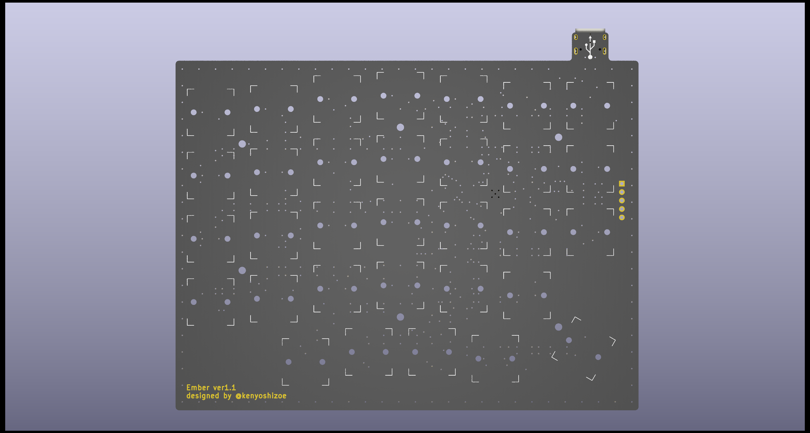
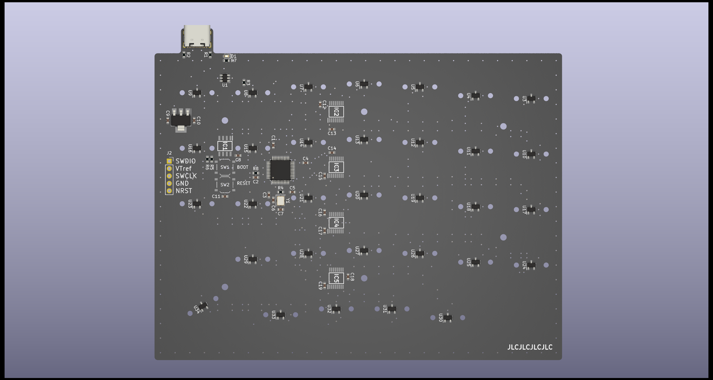
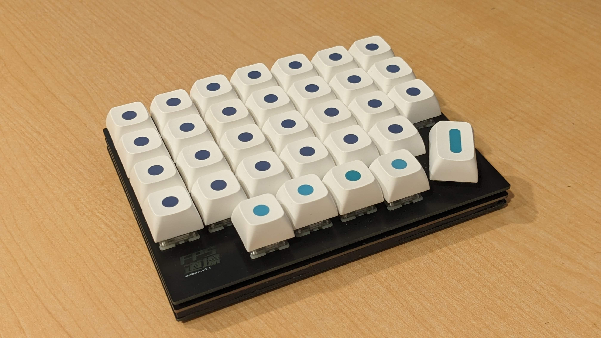

# Ember
## Overview
32Key Hall Effect Keyboard for Gaming.

## PCB
pcb/ember

The board is made with KiCAD7, all parts except the USB connector can be implemented by JLCPCB's PCBA service. Type C connector can be used 5077CR-16-SMC2-BK-TR(https://akizukidenshi.com/catalog/g/gC-14356/)

pcb was designed with KiCAD 7.
All of components except USB Connector is available at jlcpcb pcba service.

## Case
pcb/ember_bottom_plate, pcb/ember_top_plate

## Communication
This keyboard is recognized as a HID&CDC composite device. Various settings can be made from CDC.

This keyboard is recognized as HID&CDC composite device.
Configuration (Keymapping, Calibration, Rapid Trigger, etc...) can be done from CDC.

### Packet Structure
Query (Read)
| Bytes     | Description |
| --------- | ----------- |
| 0x00      | 0           |
| 0x01~0x02 | Address     |
| 0x03      | Length      |

Response (Read)
| Bytes           | Description        |
| --------------- | ------------------ |
| 0x00            | Success=0 Failed=1 |
| 0x01~0x02       | Address            |
| 0x03            | Length             |
| 0x04~(Length+4) | Data               |

Query (Write)
| Bytes           | Description |
| --------------- | ----------- |
| 0x00            | 1           |
| 0x01~0x02       | Address     |
| 0x03            | Length      |
| 0x04~(Length+4) | Data        |

Response (Write)
| Bytes     | Description        |
| --------- | ------------------ |
| 0x00      | Success=0 Failed=1 |
| 0x01~0x02 | Address            |
| 0x03      | Length             |

These queries/responses are encoded/decoded using COBS and then sent and received.
Send these query with encoding/decoding with COBS.

### Address Map
| Address       | Description                      | W/R |
| ------------- | -------------------------------- | --- |
| 0x0000-0x0004 | Key0 Config                      | W/R |
| 0x0005-0x0009 | Key1 Config                      | W/R |
| 0x000A-0x000E | Key2 Config                      | W/R |
| ...           | ...                              | ... |
| 0x009B-0x009F | Key31 Config                     | W/R |
| 0x00A0-0x0FFF | Reserved                         | -   |
| 0x1000-0x1003 | Key0 Calibaration Data           | R   |
| 0x1004-0x1007 | Key1 Calibaration Data           | R   |
| ...           | ...                              | ... |
| 0x107B-0x107F | Key31 Calibration Data           | R   |
| 0x1080-0x1FFF | Reserved                         | -   |
| 0x2000        | Key0 Push distance               | R   |
| 0x2001        | Key1 Push distance               | R   |
| ...           | ...                              | ... |
| 0x201F        | Key31 Push distance              | R   |
| 0x2020-0x2FFF | Reserved                         | -   |
| 0x3000        | Save Config                      | W   |
| 0x3001        | Calibration (0=Disable 1=Enable) | W   |
| 0x3002        | Reset Config to default          | W   |
| 0x3003        | Reset MCU                        | W   |
| 0x3004        | Enter DFU                        | W   |
| 0x3005-0xFFFF | Reserved                         | -   |

The settings for each key are as follows.
Each key config is as follows:
| Address | Description                               |
| ------- | ----------------------------------------- |
| 0x00    | key_code                                  |
| 0x01    | key_type (0: Threadhold, 1: RapidTrigger) |
| 0x06    | actuation_point (0.1mm unit)              |
| 0x07    | rappid_trigger_up_sensivity               |
| 0x08    | rappid_trigger_down_sensivity             |

Each key's calibration data is as follows.
Each key calibration data is as follows:
| Address   | Description |
| --------- | ----------- |
| 0x00~0x01 | max_value   |
| 0x02~0x03 | min_value   |
